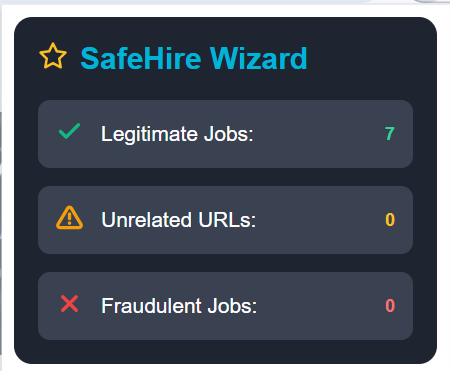
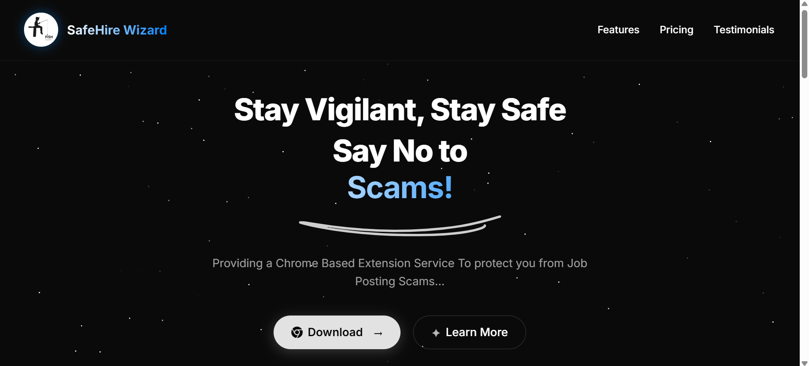
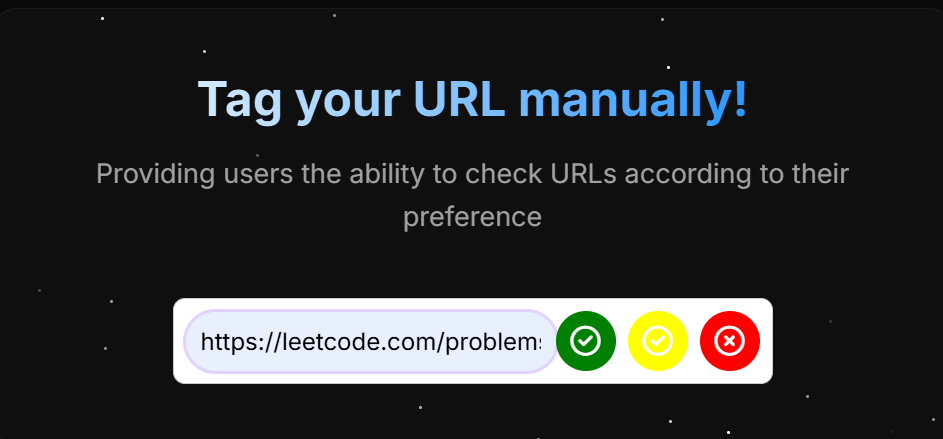

# SafeHire Wizard - Job Phishing Protection

SafeHire Wizard is a Chrome-based extension designed to protect users from phishing scams and fraudulent job postings on platforms like LinkedIn and Gmail. The extension analyzes URLs in real-time to identify potentially malicious job listings and phishing attempts.

## 🛡️ Features

- **Real-Time URL Analysis**: Instantly detects and flags phishing links and suspicious job postings
- **Multi-Platform Support**: Works seamlessly across LinkedIn and Gmail
- **Visual Indicators**: Color-coded link highlighting (red for fraudulent, green for legitimate)
- **Statistics Dashboard**: Tracks and displays counts of detected threats
- **Manual URL Tagging**: Allows users to manually tag URLs as safe or suspicious
- **Advanced Detection**: Uses a combination of machine learning and heuristic analysis

## 🧩 Project Components

The project consists of three main components:

### 1. Backend (FastAPI)

The backend server handles URL analysis and classification, processing job posting content to determine if it's legitimate, fraudulent, or unrelated.

- Uses FastAPI for the REST API
- Employs Google's Gemini API for content classification
- Integrates with MongoDB for caching results
- Implements rate limiting with Redis
- Uses Botasaurus for web scraping
- Extracts job details using NLP (spaCy)

### 2. Chrome Extension

The browser extension identifies and processes links on LinkedIn and Gmail:

- Monitors the DOM for new content
- Extracts and validates URLs
- Sends URLs to the backend for analysis
- Visually marks links based on classification results
- Maintains statistics on detected threats


### 3. Frontend Website

A promotional website showcasing the extension's features:

- Information about phishing protection
- Extension download section
- Manual URL checking functionality
- Educational content about phishing threats



## 🚀 Getting Started

### Prerequisites

- Python 3.8+
- Node.js 14+
- MongoDB
- Redis
- Chrome browser

### Backend Setup

```bash
# Clone the repository
git clone https://github.com/yourusername/FishGuard.git
cd FishGuard

# Set up virtual environment
python -m venv venv
source venv/bin/activate  # On Windows: venv\Scripts\activate

# Install dependencies
pip install -r requirements.txt

# Start Redis
redis-server

# Start the backend server
cd backend
uvicorn botsaurapp:app --reload
```

### Chrome Extension Setup

```bash
# Navigate to extension directory
cd job-fraud-detector-extension

# Install dependencies
npm install

# Build the extension
npm run build

# Load the extension in Chrome:
# 1. Open Chrome and go to chrome://extensions/
# 2. Enable "Developer mode"
# 3. Click "Load unpacked" and select the build directory
```

### Frontend Setup

```bash
# Navigate to frontend directory
cd frontend

# Serve the frontend (using any simple HTTP server)
python -m http.server 8080
```

## 🔧 API Endpoints

- `POST /analyze-job`: Analyzes a job posting URL and returns classification
- `POST /update-classification`: Updates the classification of a previously analyzed URL
- `GET /health`: Health check endpoint
- `GET /`: Home endpoint

## 🛠️ Technologies Used

- **Backend**: FastAPI, Redis, MongoDB, Botasaurus, spaCy, Google Gemini API
- **Frontend**: HTML, CSS, JavaScript
- **Extension**: TypeScript, Plasmo framework

## 🔒 Security Considerations

- The extension analyzes links locally and only sends URLs to the backend server
- No personal content from emails or messages is transmitted
- MongoDB stores only the analysis results, not the content of job postings
- Rate limiting is implemented to prevent abuse

## 📝 License

[Your License Information]

## 🤝 Contributing

Contributions are welcome! Please feel free to submit a Pull Request.

## 📞 Contact

[Your Contact Information]
